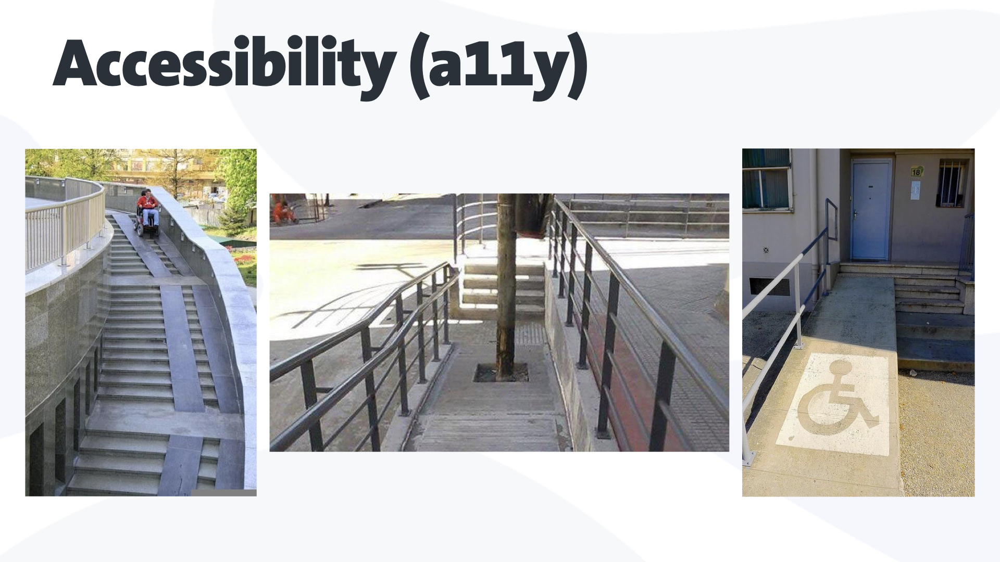
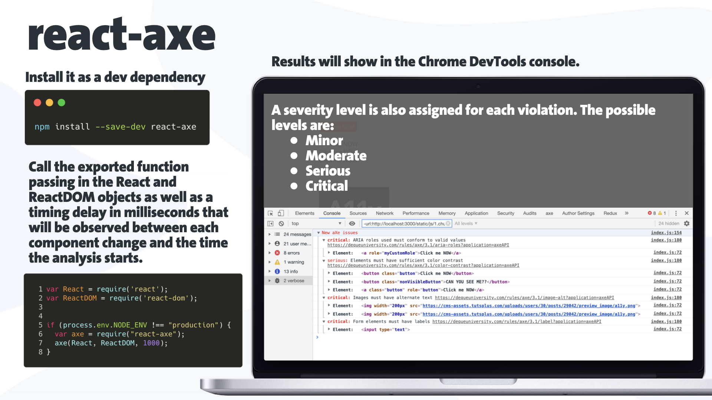
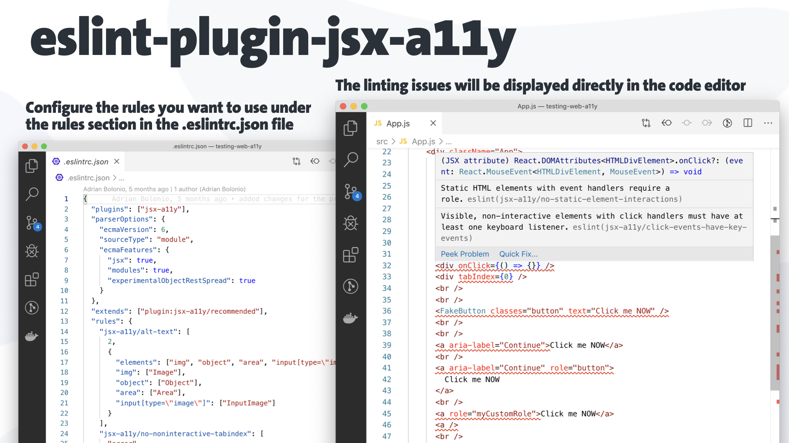
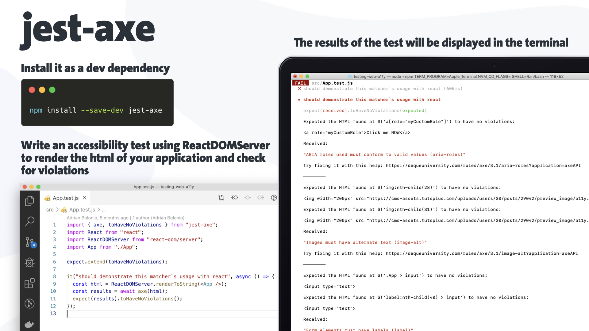

When we develop a new web application, we often put a lot of work on the design, on making it beautiful and usable.
In other words, we want our web app to be effective, efficient, and satisfying for the user.
But a lot of times we don’t think about the user experience for everyone, people with or without disabilities, including people with age-related impairments.

## Accessibility (a11y)

> “Accessibility is about providing access to information for everyone, regardless of age or ability, so that each individual can realize their full potential.“
>
> Source: [The International Association of Accessibility Professionals (IAAP)](https://www.accessibilityassociation.org/content.asp?contentid=1)

Why is it so obvious in real world that the three situations below are completely wrong?.



Probably because those three ramps were not built by disabled people, or maybe because they didn't put themselves in their shoes?
We can even think that these situations were not properly tested from the enduser perspective, nor during the design phase nor the building phase.
But it's very clear to me that these three situations are definitely wrongly done, and a person using a wheelchair will always have problems using these three "accessible" ramps.

## Web Accessibility (a11y)

> Web accessibility means that websites, tools, and technologies are designed and developed so that people with disabilities can use them.
> More specifically, people can: perceive, understand, navigate, interact with the Web, and contribute to the Web
>
> Source: [The World Wide Web Consortium (W3C)](https://www.w3.org/WAI/fundamentals/accessibility-intro/)

Let's see how we can translate this reality to the online world, because for some of us, not visually impaired people, it's not so obvious to identify a non-accessible website.
Let me show you an example. If you are in an e-commerce, an online shop for example, and you call the support team because you may want to find your latest purchases,
but you don't know how to find them, a typical answer from them could be "you need to click on the button in the top right corner".
Or maybe you want to change your password, or your email address, so they could say "you need to click on the button with the engine icon".
The problem here is that for visually impaired people such as blind people, there's no such thing as top right corner or button with the engine icon.
So we need to have these situations in mind when we develop a new website.

Based on the numbers from the [World Health Organization (WHO)](https://www.who.int/news-room/fact-sheets/detail/blindness-and-visual-impairment), it is estimated that globally, at least 2.2 billion people have a vision impairment or blindness, of whom at least 1 billion have a vision impairment that could have been prevented or has yet to be addressed.
This 1 billion people includes those with moderate or severe distance vision impairment or blindness due to unaddressed refractive error, as well as near vision impairment caused by unaddressed presbyopia.

## Testing Web Accessibility (a11y)

Automated accessibility tests can free up your QA team from manual testing every part of your application, but they can’t automatically make your site accessible.
Only 20% to 50% of all accessibility issues can be detected with automated tests, so we need to consider those automated accessibility tests as one step of a larger testing process.

I would like to give you an introduction about the tools that I usually use to test accessibility during my development process.

I've structured this serie in three parts: testing the code, testing the DOM, and testing manually in the browser.

## Testing the code

I've created a React application with three tiny components: a button, a fake button, which is an anchor link with the role button, and an image.
In the main application I've put a bunch of accessibility errors, so let's see how can I find them using some tools.

You can find the code of the application this [GitHub repository](https://github.com/bolonio/testing-web-a11y)

### Testing your application from the browser console log

The first tool I would like to show you is [react-axe](https://github.com/dequelabs/react-axe). The company behind the development of the axe tools family is [Dequelabs](https://www.deque.com/axe/).

You need to install it as a dev dependency in your React project.

```bash
$ npm install --save-dev react-axe
```

Then call the exported function passing in the React and ReactDOM objects as well as a timing delay in milliseconds that will be observed between each component change and the time the analysis starts.
You need to be sure that this is only done in a development environment and not in production.

```js
if (process.env.NODE_ENV !== "production") {
  var axe = require("react-axe")
  axe(React, ReactDOM, 1000)
}
```

This library will test your React application with the axe-core accessibility testing library while it's running, and you will be able to see the results in the Chrome DevTools console.
A severity level is also assigned for each violation. The possible levels are: Minor, Moderate, Serious, Critical.



Each violation includes the description of the issue, the HTML element in where the violation was found, and a link to the [dequeuniversity](https://dequeuniversity.com/), a full documentation source with detailed information about the issue, and the steps to solve it.
Several occurrences of the same violation are grouped.

### Using a Linter, a tool that analyzes source code to flag potential errors, bugs, and vulnerabilities

If you're using eslinter in your application, you can include the [eslint-plugin-jsx-a11y](https://github.com/evcohen/eslint-plugin-jsx-a11y) with the accessibility rules.
You just need to create the file .eslintrc.json in the root folder of your application.

```json:title=/.eslintrc.json
{
    "plugins": ["jsx-a11y"],
    "extends": ["plugin:jsx-a11y/recommended"],
    "rules": {
        ...
    }
}

```

It would be enough including `"extends": ["plugin:jsx-a11y/recommended"]`, but you can configure the rules you want to use under the rules section in the .eslintrc.json file

The linting issues will be displayed directly in the code editor and in the terminal as well.



### Writing your own unit test with jest

Another tool, as well from the axe tool family, is [jest-axe](https://github.com/nickcolley/jest-axe).

You need to install it as a dev dependency in your React project.

```noLineNumbers
$ npm install --save-dev jest-axe
```

We tend to forget that writing unit tests is part of the development process, and not a post process.
You can write an accessibility test using [jest](), a javascript testing library, and ReactDOMServer to render the html of your application and check for violations.

```js:title=/App.test.json
import { axe, toHaveNoViolations } from "jest-axe"
import React from "react"
import ReactDOMServer from "react-dom/server"
import App from "./App"

expect.extend(toHaveNoViolations)

it("should demonstrate this matcher`s usage with react", async () => {
  const html = ReactDOMServer.renderToString(<App />)
  const results = await axe(html)
  expect(results).toHaveNoViolations()
})
```

The results of the test will be displayed in the terminal when running the test.



You should include these kind of accessibility tests in your build pipeline, so code with accessibility issues shouldn't be deployed to production.
As well you can use the results of these tests to build reports for your product team or for your development team.

## The complete serie

[Testing Web Accessibility - Part 2](./testing-web-accessibility-part-2)

[Testing Web Accessibility - Part 3](./testing-web-accessibility-part-3)

If you have any question to ask, any recommendation to make, or any appreciation to give, please feel free to contact me.
The best way to reach me is either via my twitter at [@bolonio](https://twitter.com/bolonio) or you can send me an email at [adrian.bolonio@gmail.com](mailto:adrian.bolonio@gmail.com).

Thanks for reading this article.
