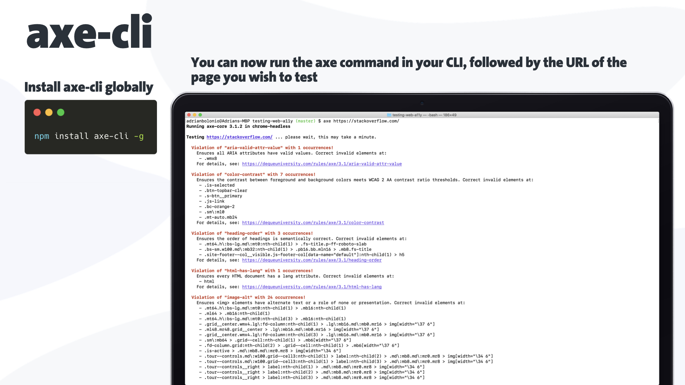
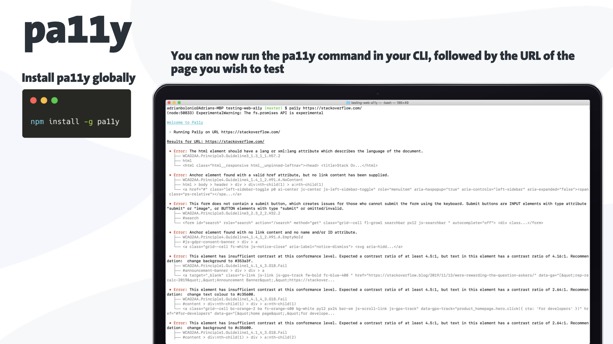
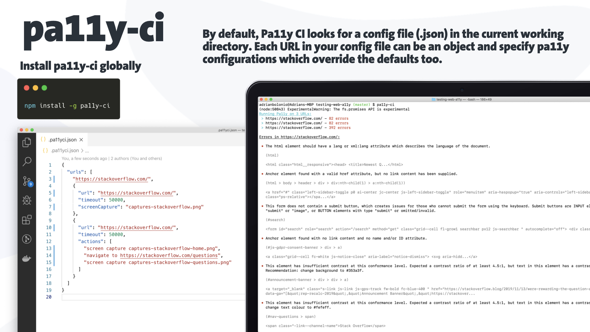
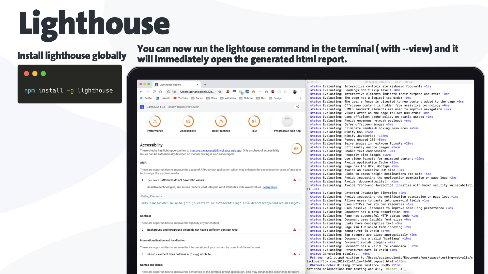

## Testing Web Accessibility (a11y)

Automated accessibility tests can free up your QA team from manual testing every part of your application, but they can’t automatically make your site accessible.
Only 20% to 50% of all accessibility issues can be detected with automated tests, so we need to consider those automated accessibility tests as one step of a larger testing process.

I would like to give you an introduction about the tools that I usually use to test accessibility during my development process.

I've structured this serie in three parts: testing the code, testing the DOM, and testing manually in the browser.

## Testing the DOM

Maybe you can think you're done with the development process, or maybe you've inherited an old codebase or an already finished application where no one took care of the web accessibility.
Then you would need the whole DOM structure of the application.

### axe-cli

Another excellent tool from the axe tool family is [axe-cli](https://github.com/dequelabs/axe-cli), that provides a command line interface for axe to run quick accessibility tests.

You need to install it globally.

```noLineNumbers
$ npm install -g axe-cli
```

You can run the `axe https://www.adrianbolonio.com/` command in your CLI, followed by the URL of the page you wish to test.



The same as with react-axe, each violation includes the description of the issue, the HTML element in where the violation was found, and a link to the [dequeuniversity](https://dequeuniversity.com/), a full documentation source with detailed information about the issue, and the steps to solve it.
Several ocurrences of the same violation are grouped.

The results can be saved as JSON data, using the `--save` and `--dir` flags.

### pa11y

Another similar tool is [pa11y](http://pa11y.org/).
A command-line interface which loads web pages and highlights any accessibility issues it finds. Useful for when you want to run a one-off test against a web page.
It runs accessibility tests on your pages via the command line or Node.js, so you can automate your testing process.

You need to install it globally.

```noLineNumbers
$ npm install -g pa11y
```

You can run the `pa11y` command in your CLI, followed by the URL of the page you wish to test.



It could be quite tedious to test one url at a time, so the interesting thing for the pa11y library is its CI-centric accessibility test runner.
The CI runs accessibility tests against multiple URLs and reports on any issues.
This is best used during automated testing of your application and can act as a gatekeeper to stop a11y issues from making it to live.

One interesting feature is that it can run actions before Pa11y tests the page.
Actions are additional interactions that you can make Pa11y perform before the tests are run.
They allow you to do things like click on a button, enter a value in a form, wait for a redirect, or wait for the URL fragment to change.



### lighthouse

[Lighthouse](https://developers.google.com/web/tools/lighthouse/) is a tool developed by Google, and it's included in the Chrome DevTools, but you can as well execute it from the terminal.
Google define it as an open-source, automated tool for improving the quality of web pages.
You can run it against any web page, public or requiring authentication.
It has audits for performance, accessibility, progressive web apps, SEO and more.

You need to install it globally.

```noLineNumbers
$ npm install -g lighthouse
```

You can run the `lighthouse` command in the terminal. Adding `--view` will immediately open the generated html report.

```noLineNumbers
$ npm lighthouse www.stackoverflow.com --view
```



At the end of the analysis, the tools will generate a final report, either HTML or JSON/CSV, that can be use for reporting purposes.

## The complete serie

[Testing Web Accessibility - Part 1](./testing-web-accessibility-part-1)

[Testing Web Accessibility - Part 3](./testing-web-accessibility-part-3)

If you have any question to ask, any recommendation to make, or any appreciation to give, please feel free to contact me.
The best way to reach me is either via my twitter at [@bolonio](https://twitter.com/bolonio) or you can send me an email at [adrian.bolonio@gmail.com](mailto:adrian.bolonio@gmail.com).

Thanks for reading this article.
